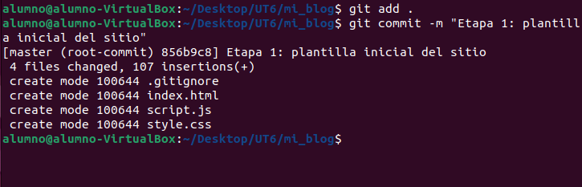
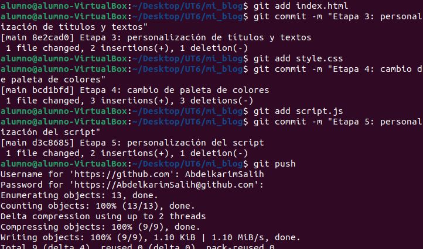

# Práctica UT6 – Despliegue de un sitio estático en GitHub Pages

## Descripción del proyecto
Este proyecto consiste en la creación y publicación de un sitio web estático utilizando HTML, CSS y JavaScript.  
El objetivo principal ha sido aprender a usar Git como sistema de control de versiones y GitHub Pages como herramienta de despliegue automático.

## Proceso de desarrollo
Durante la práctica he seguido varias fases:

- Creación de la estructura básica del sitio (`index.html`, `style.css` y `script.js`).
- Inicialización de un repositorio local con Git y realización del primer commit.
- Creación del repositorio remoto en GitHub y vinculación con el repositorio local mediante **HTTPS**.
- Realización de varios commits atómicos para personalizar el contenido, los estilos y el script.
- Publicación del sitio web utilizando GitHub Pages.

## Dificultades encontradas
La principal dificultad fue al sincronizar el repositorio local con el remoto, ya que existían diferencias entre ambas ramas.  
Este problema se resolvió utilizando el comando `git pull --no-rebase`, lo que permitió fusionar los cambios correctamente.

También fue necesario aprender el uso de **tokens de acceso personal** para autenticarme en GitHub mediante HTTPS.

## Aprendizajes adquiridos
Con esta práctica he aprendido a:

- Utilizar Git para llevar un control de versiones ordenado.
- Realizar commits atómicos con mensajes claros y descriptivos.
- Resolver conflictos básicos entre ramas locales y remotas.
- Publicar automáticamente un sitio web estático con GitHub Pages.
- Comprender la importancia de la documentación en un proyecto.

## Publicación del sitio
El sitio web está publicado en GitHub Pages y es accesible desde la siguiente URL:

👉 https://AbdelkarimSalih.github.io/mi_blog/

## Capturas de pantalla
A continuación se muestran algunas capturas del proceso (opcional):

- Primer Commit 
	
- Segundo Commit 
	
- Primer Push
	
- Otros Commits y un push
	
- Publicación con GitHub Pages
	
- Revisar el historial de commits
	
